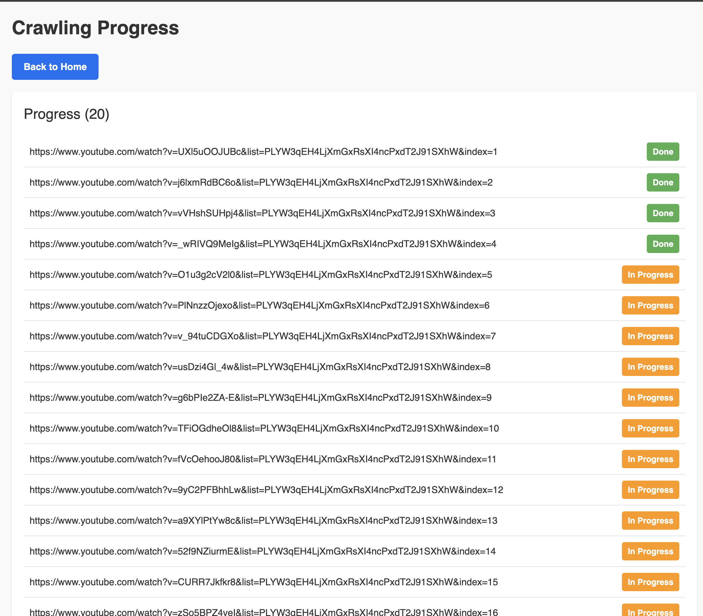

# ytb-crawling-ui

## PROJECT OVERVIEW
YouTube crawler monitor the progress of crawling workers (how many videos are in progress)

```bash
Frontend Monitoring
Technology Choice: Next.js
Reasoning: Next.js provides a robust framework for building server-side rendered React applications, which is ideal for creating real-time monitoring dashboards.
Architecture:
Pages:
    Dashboard: Displays real-time statistics of the crawling process, including the number of videos in progress, completed, and failed.
Real-Time Updates:
        WebSocket or Polling: Used for real-time updates from the backend to the frontend.
Integration:
    API Communication: Frontend communicates with the FastAPI backend to fetch status updates and control crawling tasks.
```

## Pre-requisites
- Install Node.js version 20.17.0
- Start server before running FE side

## Getting Started
First, run the development server:

Step 1
```bash
npm install
```

Step 2
```bash 
npm run dev
# or
yarn dev
# or
pnpm dev
# or
bun dev
```

Open [http://localhost:3000](http://localhost:3000) with your browser to see the result.


## Crawling Progress
Here is a screenshot of the Crawling Progress page:
- View and monitor the progress of crawling workers (how many videos are in progress).
